# Muzo - Premium Music Client
<p align="center">
  
</p>

Muzo is a powerful, privacy-focused YouTube Music client built with Flutter. It offers a premium ad-free experience with background playback, offline downloads, synchronized & karaoke lyrics, and a modern, fully gesture-driven UI.

## 🚀 Key Features

### 🎧 Immersive Audio Experience
*   **Synced & Karaoke Lyrics**: Real-time synchronized lyrics that auto-scroll with the music. Karaoke mode highlights individual words/syllables as they're sung.
*   **Lyrics in Gesture Mode**: Tap the lyrics button in gesture player to show a frosted-glass lyrics panel above the controls — double-tap and volume swipe still work through it.
*   **Lofi Mode**: Instantly transform any track into a Lofi vibe with slowed speed (0.9x), pitch correction, and native reverb effects.
*   **Multi-Language Audio**: Automatically detects and lets you switch between available audio languages for supported tracks.
*   **Background Playback**: Keep the music playing while using other apps or when your screen is off.
*   **Audio Quality Control**: Choose between High, Medium, and Low audio quality.
*   **Native Audio Effects**: Leverages platform-specific audio effects for a rich sound experience.

### 🕹️ Gesture Player
*   **Full Gesture Control**: A fully immersive gesture-based player mode — the album art fills the entire screen.
*   **Double-Tap to Play/Pause**: Double-tap anywhere (including over the lyrics panel) to toggle playback with an animated flash icon.
*   **Swipe Left/Right**: Skip to next or previous track with a horizontal swipe.
*   **Swipe Down to Close**: Swipe down on the left half of the screen to dismiss the player.
*   **Volume Bar**: Swipe up/down on the right half to control volume — a frosted-glass vertical bar with fill indicator appears and auto-fades.
*   **Bottom Controls Popup**: Glassmorphic popup at the bottom shows title, artist, progress bar, queue, lyrics, and favorite buttons.

### 📚 Library & Discovery
*   **Auto-Queue**: Never stop listening — automatically queues recommended songs for endless playback.
*   **Smart Library**: Organize your music with **Favorites**, **History**, and custom **Playlists**.
*   **Channel Subscriptions**: Subscribe to your favorite artists and YouTube channels to stay updated.
*   **Offline Downloads**: Download songs and videos for offline listening anywhere, anytime.
*   **Smart Search**: Quickly find songs, artists, albums, and playlists.
*   **Recently Played Grid**: A compact 2-column grid of your recently played tracks right on the home screen.

### 🎨 Modern UI/UX
*   **Sleek Glassmorphism**: A beautiful, modern interface with glassmorphic elements and smooth animations.
*   **Immersive Player**: Dynamic blurred album art background for a premium visual experience — no tint overlay in gesture mode.
*   **Dynamic Theming**: The UI automatically adapts colors to match the currently playing album art (palette-extracted accent colors).
*   **Marquee Titles**: Auto-scrolling text for long song titles and artist names.
*   **Smooth Transitions**: Fluid zoom and slide animations when navigating between screens.
*   **Consistent Dark Theme**: Optimized contrast and text colors for a comfortable dark mode experience.

### 🛡️ Privacy & Reliability
*   **Zero-Wait Launch**: App initializes instantly with parallel background loading.
*   **Ad-Free Streaming**: Enjoy music without interruptions or ads.
*   **Privacy Focused**: No login required. All your data (favorites, playlists, history) is stored locally on your device.
*   **RapidAPI Fallback**: Robust fallback ensures playback reliability even if the primary API fails (user-configurable).
*   **Share to Play**: Share links directly from YouTube or YouTube Music to Muzo to play them instantly.

## 📸 Screenshots

<p align="center">
  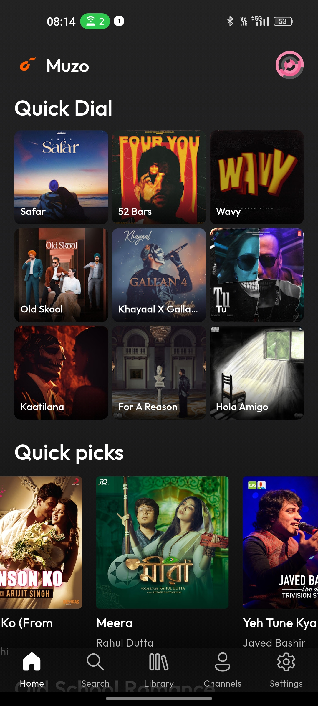
  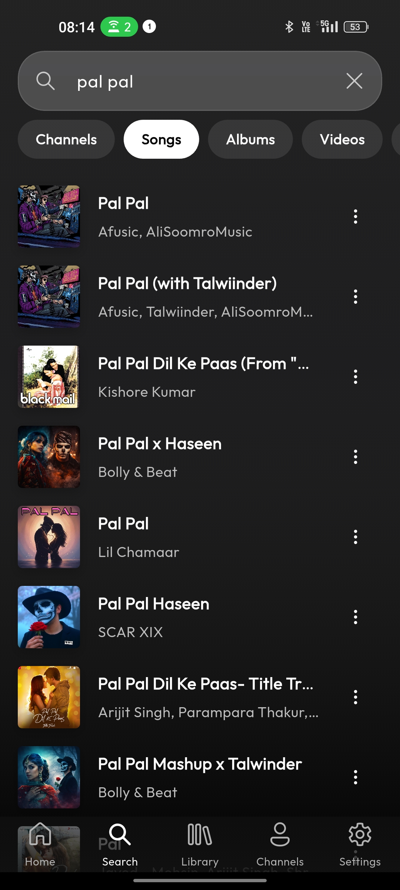
  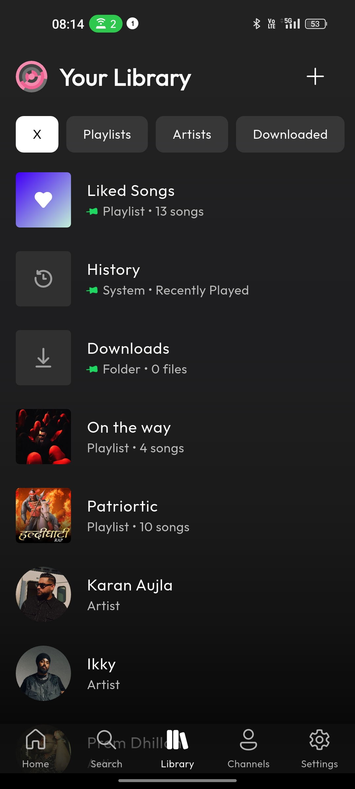
  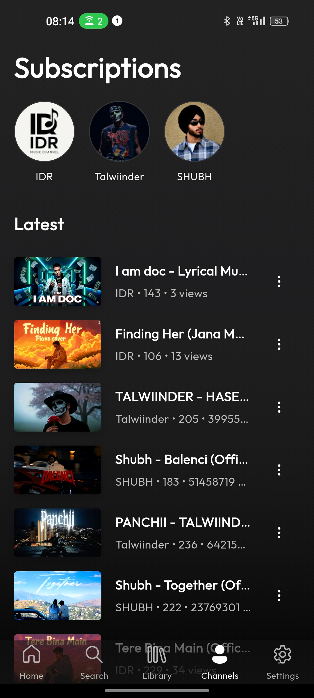
  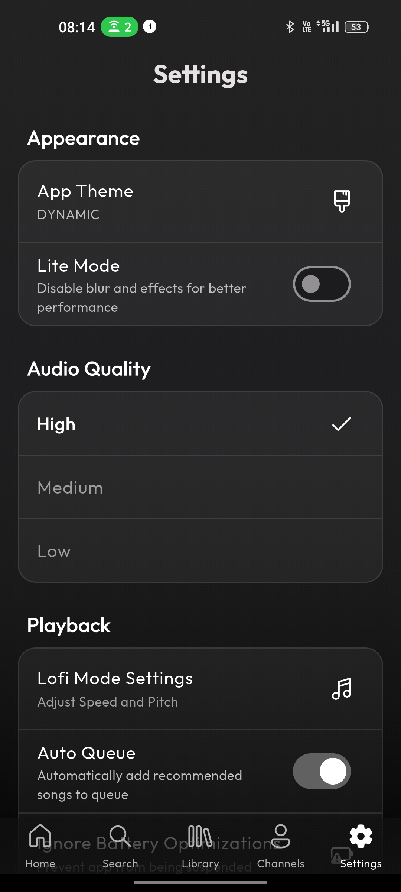
  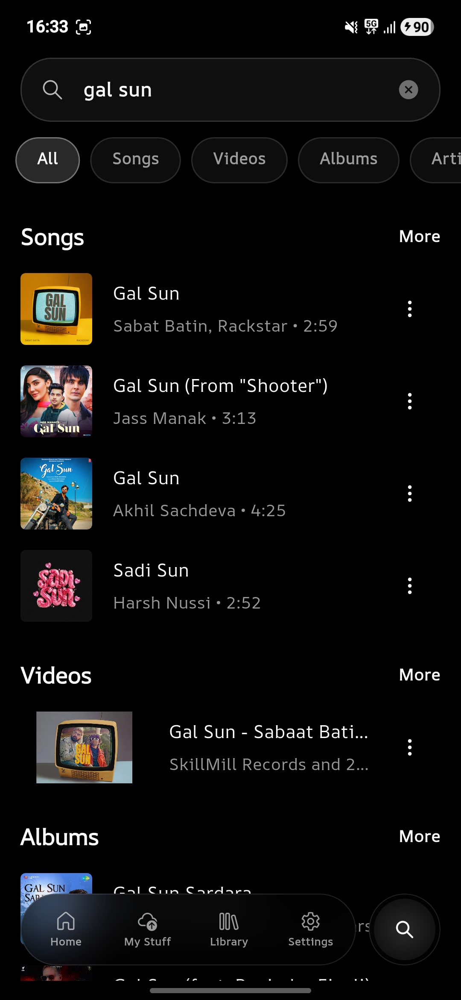
  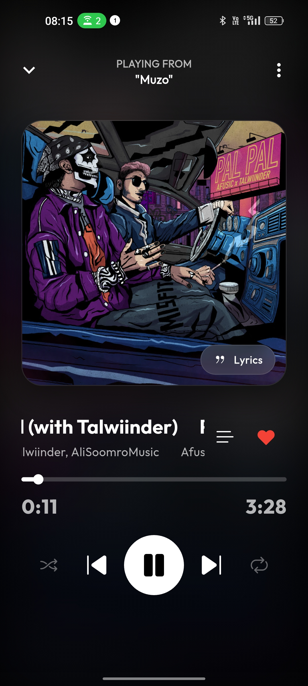
  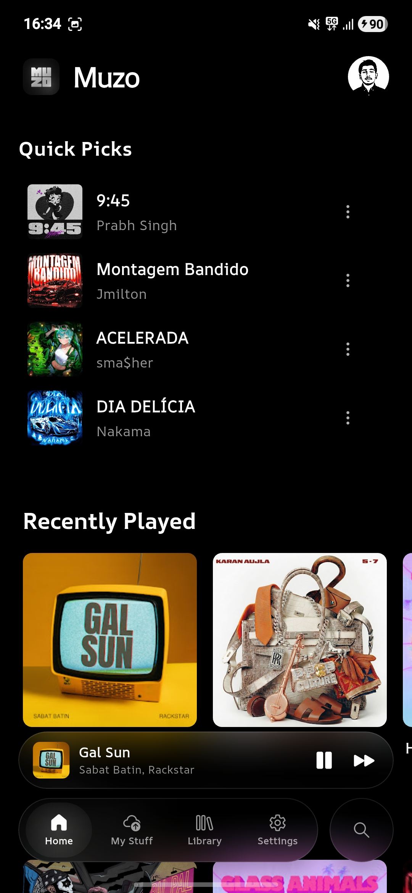
  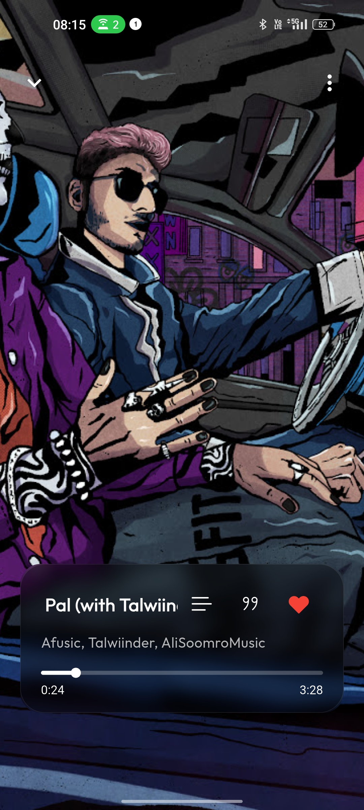
  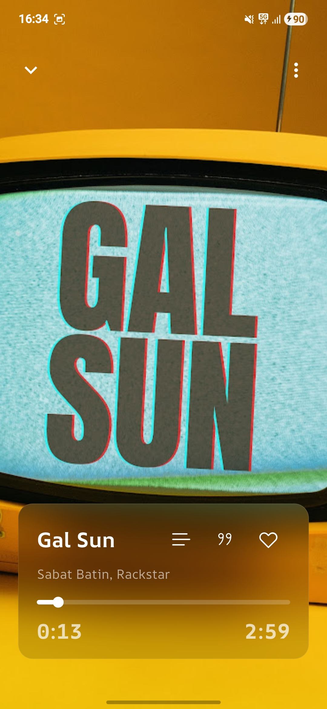
  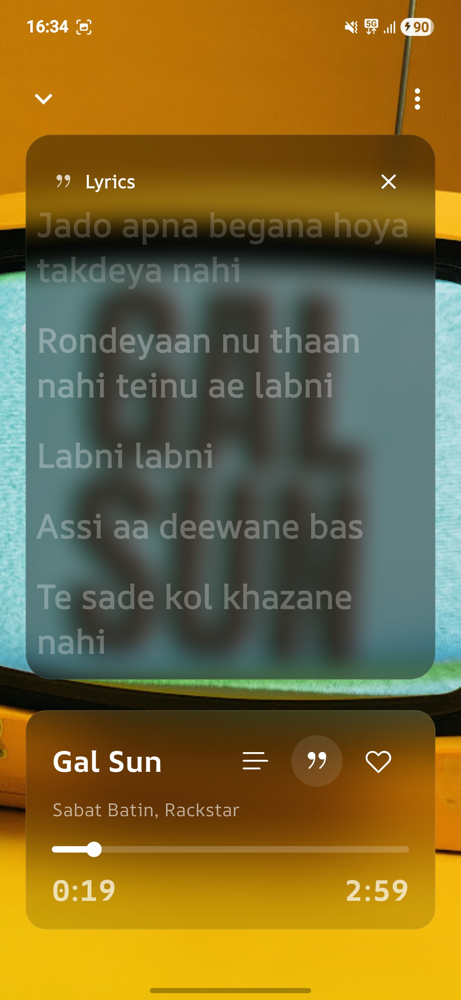
  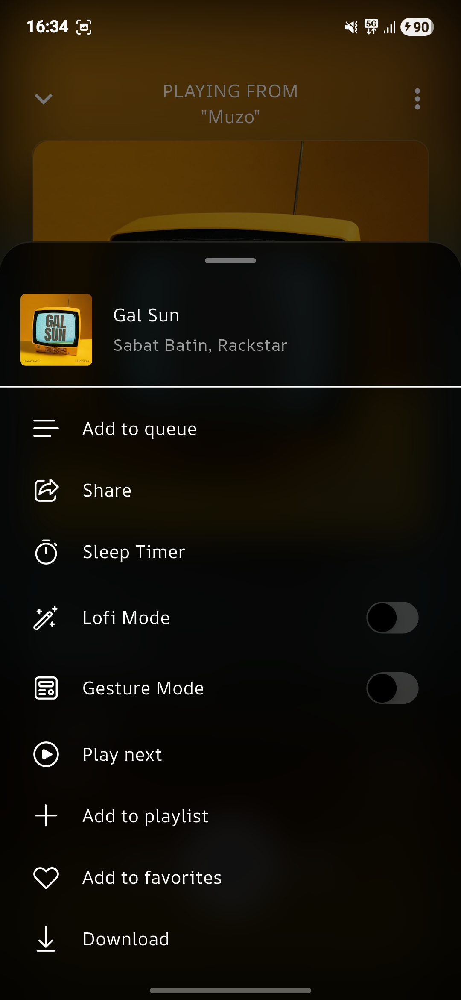
</p>

## 🛠️ Tech Stack

*   **Framework**: [Flutter](https://flutter.dev/)
*   **State Management**: [Riverpod](https://riverpod.dev/)
*   **Audio Engine**: [Just Audio](https://pub.dev/packages/just_audio) & [Audio Service](https://pub.dev/packages/audio_service)
*   **Lyrics**: [flutter_lyric](https://pub.dev/packages/flutter_lyric) + custom karaoke engine
*   **Local Storage**: [Hive](https://docs.hivedb.dev/)
*   **Networking**: [Dio](https://pub.dev/packages/dio) & [Http](https://pub.dev/packages/http)
*   **UI Components**: [FluentUI System Icons](https://pub.dev/packages/fluentui_system_icons), [Google Fonts](https://pub.dev/packages/google_fonts), [Cached Network Image](https://pub.dev/packages/cached_network_image)
*   **API**: Custom YouTube Internal API & RapidAPI (Fallback)

## ⚙️ Setup & Installation

### Prerequisites

*   Flutter SDK (Latest Stable)
*   Dart SDK
*   Android Studio / VS Code
*   Java JDK 17

### Installation

1.  **Clone the repository**:
    ```bash
    git clone https://github.com/Shashwat-CODING/Muzo.git
    cd Muzo
    ```

2.  **Install dependencies**:
    ```bash
    flutter pub get
    ```

3.  **Run the app**:
    ```bash
    flutter run
    ```

4.  **Build Release APK** (split by ABI for smaller size):
    ```bash
    flutter build apk --split-per-abi
    ```

## 🤝 Contributing

Contributions are welcome! Whether it's reporting a bug, suggesting a feature, or writing code, we appreciate your help.

### How to Contribute

1.  **Fork the Project**
2.  **Create your Feature Branch** (`git checkout -b feature/AmazingFeature`)
3.  **Commit your Changes** (`git commit -m 'Add some AmazingFeature'`)
4.  **Push to the Branch** (`git push origin feature/AmazingFeature`)
5.  **Open a Pull Request**

### Development Guidelines

*   Follow the existing code style.
*   Use `flutter analyze` to check for linting errors.
*   Ensure new features are tested.

## 📝 License

Distributed under the MIT License. See `LICENSE` for more information.

---

<p align="center">
  Built with
   
  
  
By Shashwat
</p>
